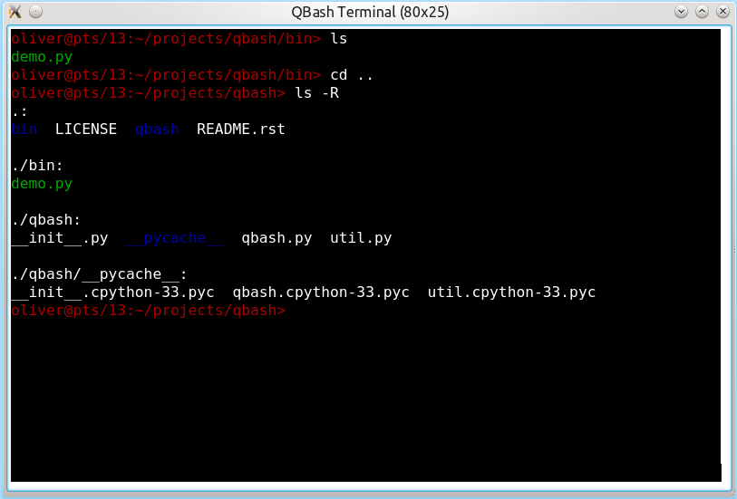
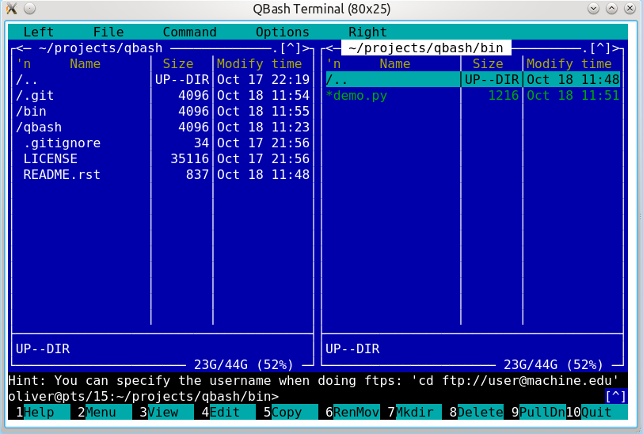

======
QBash
======

QBash embeds a Bash shell inside a Qt widget.

The terminal emulation is provided `Pyte
<https://github.com/selectel/pyte>`_.

The `bin/demo.py` script features an example of how to embed QBash
into Qt programs.

QBash depends on `Pyte`, PyQt4 and Python 3.x. On Debian based systems
like (K)Ubuntu the following packages will suffice:

.. code-block:: bash

   sudo apt-get install git python3-pyqt4 python3-pip
   sudo pip3 install pyte

To clone the repository and try out the demo use the following
commands:

.. code-block:: bash

   git clone https://github.com/qtmacsdev/qbash.git
   cd qbash/bin
   python3 demo.py

Screenshots
===========

.. image:: screenshots/qbash_top.png

LICENSE
=======

QBash is licensed under the terms of the GPL.
